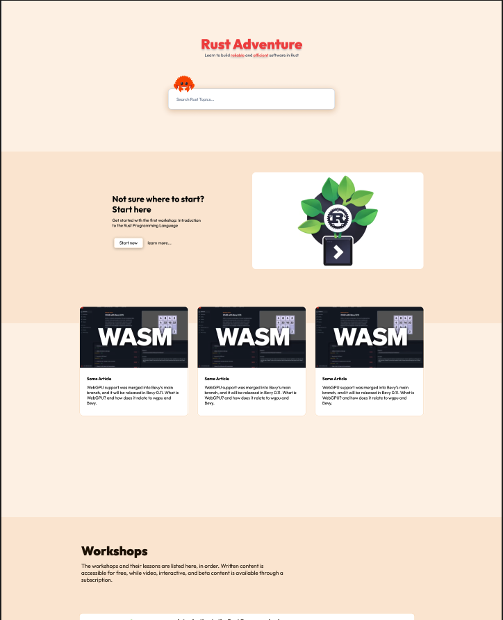

# Chris Biscardi: Oct 3 - Oct 17

## What level are you operating at?

Same as [2024-09-05](2024-09-05.md)

## What are your goals for your content?

Same as [2024-09-05](2024-09-05.md)

## What did you do in the last two weeks towards your goals.

I shipped a This Week in Bevy every week, accumulating two more weeks towards my year-long goal.

- [x] 2 of 2 This Week in Bevy issues published
- [x] 2 of 2 more This Week in Bevy videos on Mondays
- [x] 0 of 2 additional videos for Tuesdays
- [x] 0 live streams on Saturdays
- [x] 0 shorts for This Week in Bevy
- [x] Made progress on generating emails for This Week in Bevy
- [x] Made progress on Rust Adventure redesign

longer term:

- Start 0.15-rc Bevy workshops (2048 + Snake)
- Ship my new personal website (leptos 0.7-rc version)

## Is there anything new you're going to try in the next two weeks?

Bevy 0.15's release candidate is out now, so I have some maintainer duties and workshop updates to handle in the next few weeks.

Concretely this means shipping

- 2 more This Week in Bevy videos on Mondays
- 2 additional videos for Tuesdays
- 2 live streams on Saturdays
- At least 1 short from one of the previously mentioned sources

I'm also planning to:

- Finish updates to the 0.14 2048 Bevy workshop
- Start the Bevy 0.15 (2048 and Snake) workshop code
- Finish another segment on the wasm basics workshop
- Ship my new personal website (leptos 0.7-rc version)
- Send the first email for This Week in Bevy

## Farther future

- In testing for the Rust Adventure redesign work, I want to pick and implement Search on my personal site with an intent to do the same implementation on Rust Adventure in the future.
